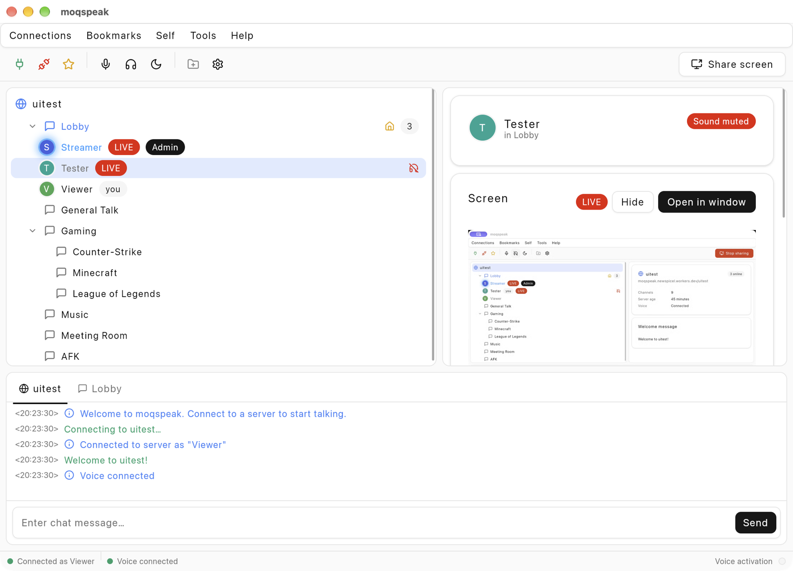

# moqspeak

**Media over QUIC Speak** is a voice chat app in the spirit of TeamSpeak: servers with a channel
tree, push-to-talk or voice activation, chat, pokes and screen sharing. It is a native Rust
application built on [zgui](https://github.com/zortax/zgui). Voice and video travel over
[Media over QUIC](https://github.com/moq-dev/moq) through Cloudflare's MoQ relay, and a small
Cloudflare Worker keeps track of servers, channels and who is where.



## Features

- **Channels the TeamSpeak way.** Double-click a channel to join it. Drag yourself or someone else
  onto another channel to move. Right-click anything for its actions.
- **Clear voice.** Opus with forward error correction, echo cancellation (WebRTC AEC3), noise
  suppression (RNNoise) and a neural speech detector that opens the microphone only for your
  voice. Push-to-talk and continuous transmission are available too.
- **Screen sharing.** On macOS, Apple's picker lets you share a single window, an app or a display.
  On Linux and Windows a display is shared. Viewers watch in the side panel or in a separate
  window. Video is AV1.
- **Roles.** Users, moderators and admins. The first person on a new server becomes its admin.
- **Per-user controls.** Local volume (0–200 %) and local mute for everyone you hear.
- **Your devices.** Choose microphone and speakers in Options; changes apply immediately.
- **Light, dark or system theme.**

## Install

Download the build for your system from
[Releases](https://github.com/Newspicel/moqspeak/releases):

| System | File |
|---|---|
| macOS 14 or later (Apple silicon) | `moqspeak-macos-arm64.dmg` |
| Windows (x86-64) | `moqspeak-windows-x86_64.zip` |
| Linux (x86-64) | `moqspeak-linux-x86_64.tar.gz` |

On first start, macOS asks for microphone access. It asks for screen recording access the first
time you share.

## Using moqspeak

Open **Connections → Connect** and enter a server address such as
`moqspeak.newspicel.workers.dev/public`. The part after the slash is the server's name. Any name
works, and a new name creates a new server with a default set of channels.

| To | Do |
|---|---|
| Join a channel | Double-click it, or select it and press Enter |
| Move someone (moderators) | Drag them onto a channel |
| Talk with push-to-talk | Hold F1, or `` ` `` while not typing |
| Message someone | Double-click them |
| Poke, mute locally, kick, change role | Right-click them |
| Share your screen | **Share screen** in the toolbar |
| Change devices, voice detection, theme | **Tools → Options** |

**Roles.** Moderators can create and edit channels, move people and kick them from a channel.
Admins can also delete channels and give or take roles. Each installation has its own
cryptographic identity (`identity.key`, next to the settings), so a role stays with the person
who has it.

## How it works

```
            ┌────────────── WebSocket (JSON) ───────────────┐
 moqspeak ──┤                                               ├──► Cloudflare Worker
  client    │                                               │    one Durable Object per server:
            │                                               │    channels, people, chat, roles
            └──── Media over QUIC (IETF draft-16) ──────────┴──► Cloudflare MoQ relay
                  one broadcast per person:
                  "audio"  – Opus, 20 ms frames
                  "screen" – AV1, a new group at every keyframe
```

The **Worker** is the control plane. When a client connects, it proves its identity by signing a
challenge, then receives the channel tree, the list of people and a token for the relay. Every
change (a join, a move, a chat message) goes through the Worker. The Worker sends the new state to
everyone on that server.

The **relay** carries the media. Each client publishes one broadcast with an `audio` track and a
`screen` track, and subscribes to the audio of everyone in its channel. Screens are fetched only
while someone watches. A screen starts a new group at each keyframe, so a viewer who joins late
sees a picture within about two seconds.

Audio stays inside the client until it is encoded. The microphone signal passes through echo
cancellation, noise suppression and speech detection before Opus encodes it. Incoming voices go
through a short jitter buffer and are mixed for the speakers.

## Building from source

You need [rustup](https://rustup.rs), which installs the pinned nightly toolchain from
`rust-toolchain.toml` automatically, plus `cmake` and `nasm`. Opus and the AV1 encoder's
assembly are built from source.

- **Linux** additionally needs the development packages listed in
  `.github/workflows/build.yml` (ALSA, X11/Wayland, PipeWire, fontconfig).
- **macOS** needs Xcode 16 or later (macOS 15 SDK) to build.

```sh
cargo run -p moqspeak --release                                    # start the app
cargo run -p moqspeak --release -- moqspeak.newspicel.workers.dev/demo Ada     # connect at start
```

To build and install the macOS app bundle:

```sh
cargo build -p moqspeak --release
packaging/macos/bundle.sh          # writes dist/moqspeak.app
cp -R dist/moqspeak.app /Applications/
```

For testing with one machine, start a headless participant. It joins a channel, beeps every two
seconds and prints whom it hears. With `--share-pattern` it also shares a moving test pattern.

```sh
cargo run -p moqspeak -- --bot moqspeak.newspicel.workers.dev/demo BeepBot Lobby --share-pattern
```

## Hosting your own server

The server is a Cloudflare Worker in `server/`. Set the relay in `server/wrangler.jsonc`
(`MOQ_RELAY`, `MOQ_RELAY_ID`, `CF_ACCOUNT_ID`), then deploy:

```sh
cd server
pnpm install
wrangler deploy
```

Clients need a token for the relay. There are two ways to give them one:

- **A fixed token.** Create one with
  `cf realtime moq relays tokens create <relay-id> --operations publish subscribe` and store it with
  `wrangler secret put MOQ_TOKEN`.
- **Rotating tokens (recommended).** Store a Cloudflare API token that can manage MoQ relay
  tokens with `wrangler secret put CF_API_TOKEN`. The Worker then creates a token valid for
  24 hours, replaces it when less than six hours remain, and deletes expired ones. If rotation
  fails, it falls back to `MOQ_TOKEN` and logs why.

A relay accepts at most ten tokens, so all clients share the current token; it is not one token per
session.

## Releases

Every push builds and tests on Linux, macOS and Windows. Pushing a tag such as `v0.2.0` also
publishes a GitHub release with the three downloads above.

macOS builds are signed with your Developer ID and notarized when these repository secrets exist.
Without them, the app is signed ad hoc.

| Secret | Contents |
|---|---|
| `MACOS_CERTIFICATE` | The *Developer ID Application* certificate with its private key, exported as `.p12` and base64-encoded (`base64 -i cert.p12 \| pbcopy`) |
| `MACOS_CERTIFICATE_PASSWORD` | The password of that `.p12` file |
| `APPLE_API_KEY` | An App Store Connect API key (`AuthKey_….p8`, role *Developer*), base64-encoded |
| `APPLE_API_KEY_ID` | The ID of that key |
| `APPLE_API_ISSUER_ID` | The issuer ID shown on the App Store Connect API keys page |

## Project layout

| Path | Contents |
|---|---|
| `client/src/ui/` | The interface: one zgui component per file, and `style.css` |
| `client/src/audio/` | Devices, Opus, mixing, echo cancellation, noise suppression, speech detection |
| `client/src/screen/` | Screen capture, AV1 encoding and decoding |
| `client/src/media.rs` | Publishing and subscribing over Media over QUIC |
| `client/src/engine.rs` | The network side: Worker connection, reconnects, sharing |
| `client/src/identity.rs` | The Ed25519 identity |
| `server/src/index.ts` | The Worker: servers, channels, roles and relay tokens |
| `packaging/` | Icons, the macOS bundle script and the Linux desktop file |

## Known limitations

- Anyone who can reach a server can join it. Roles control what people can do, not who can
  enter. Server passwords are not implemented yet.
- Screen sharing adds roughly a third of a second of delay, from the AV1 encoder.
- macOS builds are Apple silicon only.

## License

ISC, see [`LICENSE`](LICENSE). Icons are from [Lucide](https://lucide.dev), also ISC.
